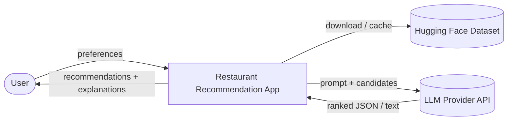
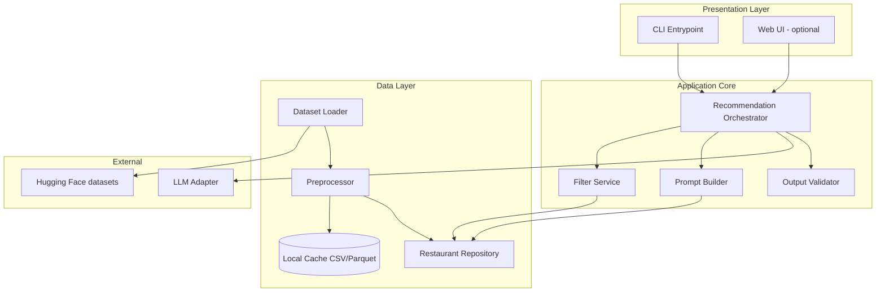
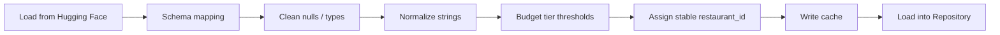
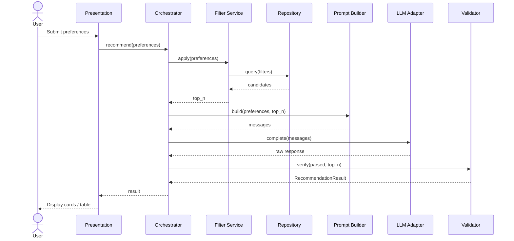
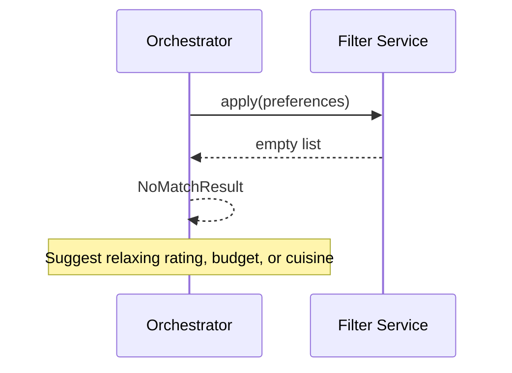
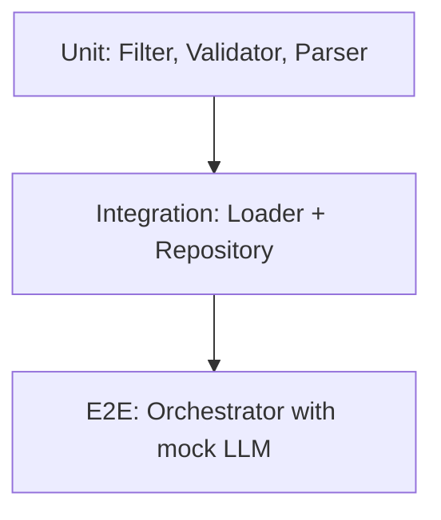
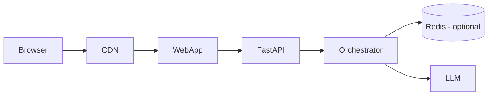

# Architecture: AI-Powered Restaurant Recommendation System

This document describes the technical architecture for the system defined in [problemstatement.md](./problemstatement.md). It is the blueprint for implementation: components, data flows, interfaces, and extension points.

---

## 1. Architectural goals

| Goal | Design implication |
|------|-------------------|
| **Correctness over creativity** | LLM only ranks/explains pre-filtered candidates; never invents restaurants |
| **Separation of concerns** | Deterministic filtering vs probabilistic ranking/explanation |
| **Provider flexibility** | LLM behind an adapter interface; **Groq** is the default provider (OpenAI-compatible API) |
| **Demo-friendly latency** | Cache dataset locally; cap candidates sent to LLM (e.g. N ≤ 15) |
| **Incremental delivery** | CLI or API first; web UI as thin client over same core |

**Core pattern:** `Filter (structured) → Constrain (top-N) → Generate (LLM) → Validate → Present`

---

## 2. System context (C4 Level 1)



**Actors**

- **User** — Submits location, budget, cuisine, minimum rating, optional free-text preferences.
- **Hugging Face** — Source of truth for restaurant records ([ManikaSaini/zomato-restaurant-recommendation](https://huggingface.co/datasets/ManikaSaini/zomato-restaurant-recommendation)).
- **LLM provider** — External API for ranking and natural-language explanations.

**Boundaries**

- No live Zomato API, auth, or payments in v1.
- All restaurant facts come from the dataset until explicitly extended.

---

## 3. Container view (C4 Level 2)

Recommended deployment for the prototype: **monolith application** with clear internal modules. Optional split into API + UI later without changing the core.



| Container | Responsibility |
|-----------|----------------|
| **Presentation** | Collect input, render results, surface errors to user |
| **Recommendation Orchestrator** | Single use-case entry: `recommend(preferences) → Result` |
| **Filter Service** | Hard constraints on structured fields |
| **Prompt Builder** | Serializes preferences + candidate rows into LLM messages |
| **LLM Adapter** | Provider-specific API calls; returns structured response |
| **Output Validator** | Ensures every recommended name exists in candidate set |
| **Dataset Loader / Preprocessor** | Ingest, clean, normalize, persist cache |
| **Restaurant Repository** | Query interface over in-memory DataFrame or cached file |

---

## 4. Component view (C4 Level 3)

### 4.1 Recommendation Orchestrator

Central workflow coordinator. No business rules beyond sequencing and error handling.

```
recommend(user_preferences):
  1. validate_preferences()
  2. candidates = filter_service.apply(preferences)
  3. if empty: return NoMatchResult
  4. top_n = filter_service.cap_by_rating(candidates, N=15)
  5. messages = prompt_builder.build(preferences, top_n)
  6. raw = llm_adapter.complete(messages)
  7. parsed = response_parser.parse(raw)
  8. validated = validator.verify(parsed, top_n)
  9. return RecommendationResult(validated)
```

### 4.2 Filter Service

Pure, deterministic, unit-testable.

| Filter | Logic |
|--------|--------|
| Location | Case-insensitive match on city/location column |
| Cuisine | Substring or token match in cuisines field |
| Min rating | `rating >= min_rating` |
| Budget | Map `low` / `medium` / `high` to cost-for-two ranges (configurable percentiles per city or global) |

**Cap step:** Sort by rating (desc), then votes/popularity if available; take top `MAX_CANDIDATES_FOR_LLM` (default 15).

### 4.3 Prompt Builder

Produces a **system** + **user** message pair:

- **System:** Role, constraints (“only recommend from the list”), output schema (JSON preferred).
- **User:** Serialized preferences + markdown/table of candidates with id, name, cuisine, rating, cost.

Using restaurant **ids** in the prompt enables the validator to match LLM output to rows reliably.

### 4.4 LLM Adapter

Interface (language-agnostic):

```text
LLMClient.complete(messages: list[Message], config: LLMConfig) -> str
```

Implementations: **`GroqClient`** (primary), `MockLLMClient` (tests). Future: `OpenAIClient`, `AnthropicClient`, `OllamaClient`. Config: model name, temperature (low, e.g. 0.2), max tokens, timeout, retries.

**Groq defaults:** `llm_provider: groq`, `llm_model: llama-3.3-70b-versatile`. API key via `GROQ_API_KEY` or `LLM_API_KEY`.

### 4.5 Response Parser

- Prefer **JSON mode** / structured output: `{ summary, recommendations: [{ id, rank, explanation }] }`
- Fallback: regex or secondary LLM call only if needed (avoid in v1)

### 4.6 Output Validator

| Check | Action on failure |
|-------|-------------------|
| Every `id` in LLM output ∈ candidate ids | Drop invalid rows or retry once with stricter prompt |
| Rank order 1..k unique | Re-sort by rank field |
| Required fields present | Map from candidate row by id; fill name, cuisine, rating, cost |

**Anti-hallucination rule:** Display fields (name, rating, cost) always come from the **dataset row**, not from LLM free text.

### 4.7 Data pipeline



---

## 5. Logical layering

```
┌─────────────────────────────────────────┐
│  Presentation (CLI / Streamlit / React) │
├─────────────────────────────────────────┤
│  Application (Orchestrator, DTOs)       │
├─────────────────────────────────────────┤
│  Domain (Preferences, Restaurant,       │
│          Recommendation, Filters)       │
├─────────────────────────────────────────┤
│  Infrastructure (HF loader, LLM client, │
│                  file cache, config)      │
└─────────────────────────────────────────┘
```

**Dependency rule:** Domain does not import infrastructure. Orchestrator depends on interfaces (`RestaurantRepository`, `LLMClient`) implemented in infrastructure.

---

## 6. Domain model

### 6.1 Entities

```text
Restaurant
  - id: str
  - name: str
  - city: str
  - cuisines: list[str]
  - rating: float
  - cost_for_two: int | float
  - votes: int | optional
  - raw: dict | optional   # extra columns for future use

UserPreferences
  - location: str
  - budget: enum(low, medium, high)
  - cuisine: str
  - min_rating: float
  - extras: str | optional   # free-text for LLM only

Recommendation
  - restaurant: Restaurant
  - rank: int
  - explanation: str

RecommendationResult
  - recommendations: list[Recommendation]
  - summary: str | optional
  - metadata: { candidate_count, filter_ms, llm_ms }
```

### 6.2 Budget mapping (config-driven)

```yaml
# config/budget_tiers.yaml (example)
global:
  low:    [0, 500]
  medium: [501, 1500]
  high:   [1501, 999999]
```

Per-city overrides optional later; v1 can use global percentiles computed at preprocess time.

---

## 7. Sequence: happy path



---

## 8. Sequence: no matches



No LLM call when `candidates` is empty (saves cost and avoids hallucination).

---

## 9. LLM contract

### 9.1 Prompt structure (conceptual)

**System message (excerpt)**

- You are a restaurant recommendation assistant.
- You may ONLY recommend restaurants from the provided CANDIDATE_LIST.
- Return valid JSON matching the schema.
- Use `id` from the list for each recommendation.
- Explanations must reference user preferences including extras.

**User message (excerpt)**

```json
{
  "preferences": {
    "location": "Bangalore",
    "budget": "medium",
    "cuisine": "Italian",
    "min_rating": 4.0,
    "extras": "family-friendly, quick service"
  },
  "candidates": [
    { "id": "r_1042", "name": "...", "cuisines": "...", "rating": 4.5, "cost_for_two": 800 }
  ],
  "max_recommendations": 5
}
```

### 9.2 Expected response schema

```json
{
  "summary": "Short overview of top picks for your criteria.",
  "recommendations": [
    {
      "id": "r_1042",
      "rank": 1,
      "explanation": "2-3 sentences tied to preferences."
    }
  ]
}
```

### 9.3 Reliability tactics

| Tactic | Purpose |
|--------|---------|
| Low temperature | Stable ranking |
| JSON / structured output | Parseable results |
| Candidate cap (≤15) | Token and latency control |
| Id-based references | Validator can enforce membership |
| Facts from repository | Name, rating, cost never taken from LLM prose |
| Single retry on validation failure | Stricter “JSON only, ids from list” reminder |

---

## 10. Proposed repository layout

```
Ai/
├── docs/
│   ├── problemstatement.md
│   └── architecture.md          # this file
├── config/
│   ├── settings.yaml              # paths, N, API keys via env
│   └── budget_tiers.yaml
├── data/
│   └── .gitkeep                   # cached parquet (gitignored)
├── src/
│   └── restaurant_rec/
│       ├── __init__.py
│       ├── main.py                # CLI entry
│       ├── domain/
│       │   ├── models.py
│       │   └── preferences.py
│       ├── application/
│       │   └── orchestrator.py
│       ├── services/
│       │   ├── filter_service.py
│       │   ├── prompt_builder.py
│       │   ├── response_parser.py
│       │   └── validator.py
│       ├── infrastructure/
│       │   ├── dataset_loader.py
│       │   ├── preprocessor.py
│       │   ├── restaurant_repository.py
│       │   └── llm/
│       │       ├── base.py
│       │       ├── groq_client.py
│       │       ├── mock_client.py
│       │       └── factory.py
│       └── presentation/
│           ├── cli.py
│           └── streamlit_app.py   # optional
├── tests/
│   ├── test_filter_service.py
│   ├── test_validator.py
│   └── test_orchestrator.py       # mock LLM
├── .env.example
├── requirements.txt
└── README.md
```

---

## 11. Configuration

| Variable / setting | Description | Default |
|--------------------|-------------|---------|
| `HF_DATASET_ID` | Hugging Face dataset id | `ManikaSaini/zomato-restaurant-recommendation` |
| `DATA_CACHE_PATH` | Local parquet/csv path | `data/restaurants.parquet` |
| `MAX_CANDIDATES_FOR_LLM` | Cap before prompt | `15` |
| `MAX_RECOMMENDATIONS` | Results shown to user | `5` |
| `LLM_PROVIDER` | `groq` (default) \| openai \| anthropic \| ollama | `groq` |
| `LLM_MODEL` | Model name | `llama-3.3-70b-versatile` |
| `GROQ_API_KEY` / `LLM_API_KEY` | Secret | from environment |
| `LLM_TEMPERATURE` | Sampling | `0.2` |
| `LLM_TIMEOUT_SEC` | Request timeout | `60` |

Load order: defaults → `config/settings.yaml` → environment variables (secrets never committed).

---

## 12. API surface (optional HTTP layer)

If exposing REST for a future web UI:

| Method | Path | Description |
|--------|------|-------------|
| `POST` | `/api/v1/recommendations` | Body: `UserPreferences` → `RecommendationResult` |
| `GET` | `/api/v1/health` | Liveness |
| `GET` | `/api/v1/meta/locations` | Distinct cities (for dropdowns) |
| `GET` | `/api/v1/meta/cuisines` | Distinct cuisines (optional) |

**`POST /api/v1/recommendations` request**

```json
{
  "location": "Delhi",
  "budget": "low",
  "cuisine": "Chinese",
  "min_rating": 3.5,
  "extras": "quick service"
}
```

**Response**

```json
{
  "summary": "...",
  "recommendations": [
    {
      "rank": 1,
      "restaurant": {
        "id": "r_001",
        "name": "...",
        "cuisines": ["Chinese"],
        "rating": 4.2,
        "cost_for_two": 400
      },
      "explanation": "..."
    }
  ],
  "metadata": { "candidate_count": 12, "duration_ms": 2400 }
}
```

Errors: `400` validation, `404` no matches (with suggestions), `502` LLM failure, `503` dataset not loaded.

---

## 13. Error handling

| Scenario | Behavior |
|----------|----------|
| Invalid preferences (missing location) | `400` / CLI message; no LLM call |
| Zero candidates after filter | Return `NoMatchResult` with hints to relax filters |
| LLM timeout / 5xx | Retry once; then graceful error + show top 3 by rating without explanations |
| Malformed LLM JSON | Retry with stricter prompt; fallback to rating-only list |
| Hallucinated id in response | Strip entry; log warning; if &lt;3 remain, partial result + notice |
| Dataset load failure | Fail fast at startup with clear log |

---

## 14. Non-functional requirements

| Attribute | Target (prototype) |
|-----------|-------------------|
| **Latency** | &lt; 5s end-to-end for ≤15 candidates (network-dependent) |
| **Availability** | Single process; no HA required |
| **Scalability** | In-memory DataFrame sufficient for demo dataset size |
| **Observability** | Structured logs: filter count, LLM latency, validation drops |
| **Security** | API keys in env only; no PII stored |
| **Testability** | Mock `LLMClient`; fixture DataFrame for filters |

---

## 15. Testing strategy



| Layer | Focus |
|-------|--------|
| **Unit** | Budget boundaries, cuisine matching, validator rejects unknown ids |
| **Integration** | HF load → preprocess → cache → query |
| **E2E** | Full `recommend()` with canned LLM JSON; assert 3+ results match success criteria |
| **Manual** | Spot-check explanations vs preferences; no fabricated names |

---

## 16. Deployment options

### 16.1 Local development (default)

```text
python -m restaurant_rec.main --location Bangalore --budget medium ...
```

Or Streamlit: `streamlit run src/restaurant_rec/presentation/streamlit_app.py`

### 16.2 Container (optional)

```dockerfile
# Single image: app + pre-baked data/cache build step
# ENV: GROQ_API_KEY (or LLM_API_KEY), LLM_PROVIDER=groq
# CMD: uvicorn or streamlit
```

Dataset cache baked at build time or downloaded on first start (slower cold start).

### 16.3 Future production sketch



Out of scope for v1 per problem statement.

---

## 17. Extension points (from problem statement)

| Future capability | Hook |
|-------------------|------|
| Web UI | Same `recommend()` via REST |
| Auth / history | Store `UserPreferences` + results in DB; inject into prompt as “past likes” |
| Feedback loop | `POST /feedback` adjusts weights before LLM or filters |
| Embeddings / semantic search | Optional pre-filter stage before rule filter |
| Multi-language | Template layer on explanations post-LLM or native prompt locale |
| Per-city budget tiers | `budget_tiers.yaml` keyed by city |

---

## 18. Technology recommendations

| Concern | Suggested choice | Rationale |
|---------|------------------|-----------|
| Language | Python 3.11+ | Hugging Face `datasets`, pandas, rich LLM SDKs |
| Data | pandas + pyarrow (Parquet cache) | Fast filter/groupby for prototype |
| HF load | `datasets` library | Native Hugging Face integration |
| LLM | Groq SDK (`groq`) behind adapter | Fast inference, JSON-friendly models |
| CLI | `typer` or `argparse` | Quick demo |
| Web UI (optional) | Streamlit | Fastest path for v1 UI |
| API (optional) | FastAPI | Async, OpenAPI docs |
| Config | `pydantic-settings` + YAML | Typed config, env override |
| Tests | `pytest` | Standard Python tooling |

---

## 19. Mapping to success criteria

| Success criterion | Architectural mechanism |
|-------------------|-------------------------|
| Dataset loads reliably | Loader + cache + startup health check |
| ≥3 relevant suggestions | Filter + top-N + `MAX_RECOMMENDATIONS=5` |
| No fabricated venues | Validator + facts from Repository only |
| Preference-aware explanations | Prompt includes `extras`; explanation field from LLM only |
| Reasonable demo latency | Candidate cap, local cache, low temperature, concise prompt |

---

## 20. Decision log

| Decision | Alternatives considered | Rationale |
|----------|-------------------------|-----------|
| Filter-then-LLM | LLM-only search over full data | Prevents hallucination; cheaper; aligns with problem statement |
| JSON LLM output | Free-form markdown | Easier validation and UI binding |
| Monolith modules | Microservices | Scope is prototype; simpler ops |
| Id-based candidate list | Name-only | Names collide; ids simplify validation |
| Optional Streamlit UI | CLI-only | Problem statement allows either; API-ready core supports both |

---

## 21. Related documents

- [problemstatement.md](./problemstatement.md) — Problem, scope, and success criteria
- `README.md` (to be added) — Setup, env vars, run instructions
