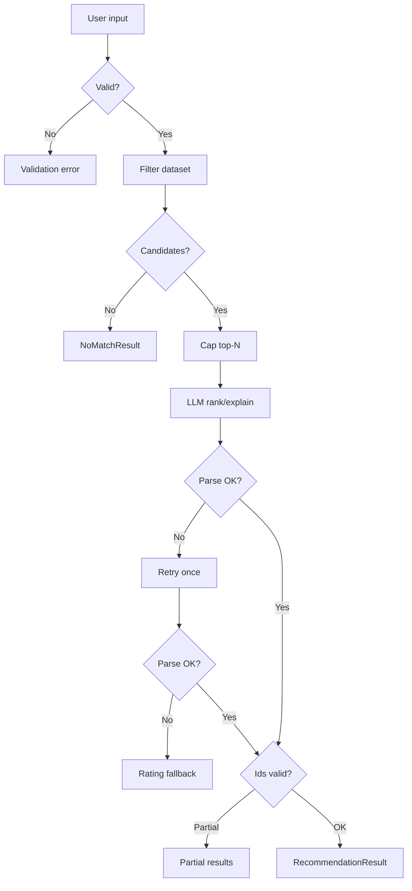

# Edge Cases & Exception Handling

Catalog of edge cases for the **AI-Powered Restaurant Recommendation System**, derived from [architecture.md](./architecture.md) and [implementation-plan.md](./implementation-plan.md).

Use this document during implementation and QA. Each case lists **trigger**, **expected behavior**, **phase owner**, and **how to verify**.

**Legend**

| Severity | Meaning |
|----------|---------|
| P0 | Must handle in MVP; incorrect behavior breaks trust or crashes |
| P1 | Should handle in MVP; degraded UX acceptable |
| P2 | Document or defer; acceptable for prototype |

---

## 1. Data ingestion & preprocessing

| ID | Edge case | Severity | Expected behavior | Phase | Verify |
|----|-----------|----------|-------------------|-------|--------|
| D-01 | Hugging Face unreachable (network down) | P0 | Fail with clear error; suggest retry; do not start with empty repo | 1 | Disconnect network; run loader |
| D-02 | Dataset schema changed (column renamed/missing) | P0 | Fail fast with mapping error listing missing columns | 1 | Break mapper in test |
| D-03 | Empty dataset returned from HF | P0 | Abort ingest; log error | 1 | Mock empty DataFrame |
| D-04 | Corrupt or partial Parquet cache | P1 | Detect on load; re-run ingest or `--refresh-data` | 1 | Truncate parquet file |
| D-05 | Missing `restaurants.parquet` on first run | P0 | Auto-download and create cache | 1 | Delete cache; cold start |
| D-06 | Stale cache after dataset version bump | P1 | `--refresh-data` overwrites cache | 1 | Change `HF_DATASET_ID` |
| D-07 | Null / empty restaurant name | P1 | Drop row or assign placeholder; log count dropped | 1 | Fixture with null names |
| D-08 | Null rating | P1 | Drop row or exclude from rating filters | 1 | Fixture with null ratings |
| D-09 | Null or zero `cost_for_two` | P1 | Exclude from budget filter or treat as unknown tier | 1 | Fixture with null cost |
| D-10 | Rating stored as string (`"4.5/5"`) | P1 | Parse or drop; never compare as string | 1 | Mixed-type column |
| D-11 | Cost stored as string (`"₹800"`) | P1 | Strip symbols; cast to numeric | 1 | Currency strings |
| D-12 | Duplicate restaurant name in same city | P1 | Unique `restaurant_id` still assigned (hash/index) | 1 | Duplicate fixture |
| D-13 | City name variants (`Bengaluru` vs `Bangalore`) | P1 | Normalize via alias map or fuzzy match (document limitation if exact only) | 1, 2 | Query both spellings |
| D-14 | Cuisine list delimiter inconsistent (`,` vs `, `) | P1 | Normalize on ingest | 1 | Mixed delimiters |
| D-15 | Extremely long cuisine string | P2 | Truncate in display only; filter still works | 1 | 500-char cuisine |
| D-16 | Disk full when writing Parquet | P0 | Fail with OS error message | 1 | Simulate if possible |
| D-17 | Very large dataset (memory pressure) | P2 | Document in-memory limit; optional chunking later | 1 | Monitor memory on load |

---

## 2. Configuration & environment

| ID | Edge case | Severity | Expected behavior | Phase | Verify |
|----|-----------|----------|-------------------|-------|--------|
| C-01 | Missing `.env` / `LLM_API_KEY` | P0 | LLM path fails clearly; mock/fallback for tests | 0, 3 | Unset env |
| C-02 | Invalid `LLM_PROVIDER` value | P0 | Validation error at startup | 0 | Set `LLM_PROVIDER=foo` |
| C-03 | `budget_tiers.yaml` missing | P0 | Fail startup or use documented defaults | 0, 2 | Remove file |
| C-04 | Overlapping budget tier ranges | P1 | Document precedence (e.g. first match) or validate at load | 0, 2 | Overlapping YAML |
| C-05 | `MAX_CANDIDATES_FOR_LLM` = 0 or negative | P0 | Reject in settings validation | 0 | Invalid config |
| C-06 | `MAX_CANDIDATES_FOR_LLM` > 50 | P1 | Warn in logs (token cost); allow but cap hard max | 0, 3 | Set to 100 |
| C-07 | Env overrides YAML incorrectly (typo in var name) | P1 | Document required names in README | 0 | Wrong env key |
| C-08 | Secrets committed to git | P0 | `.gitignore` blocks `.env`; never log API key | 0 | Grep logs |

---

## 3. User input & preferences

| ID | Edge case | Severity | Expected behavior | Phase | Verify |
|----|-----------|----------|-------------------|-------|--------|
| U-01 | Missing `location` | P0 | Validation error; no filter/LLM call | 2, 4, 5 | Omit `--location` |
| U-02 | Empty string `location=""` | P0 | Same as missing | 2, 5 | Empty flag |
| U-03 | Unknown city (not in dataset) | P0 | `NoMatchResult` with hint to try valid cities | 2, 4 | `--location Atlantis` |
| U-04 | City name wrong case (`bangalore`) | P1 | Case-insensitive match | 2 | Lowercase input |
| U-05 | City with leading/trailing spaces | P1 | Trim before filter | 2 | `" Bangalore "` |
| U-06 | Invalid `budget` enum | P0 | Validation error listing allowed values | 2, 5 | `--budget cheap` |
| U-07 | Missing `cuisine` | P1 | Either require or treat as “any cuisine” (document choice) | 2, 5 | Omit cuisine |
| U-08 | Cuisine substring no match (`Sushi` in city with none) | P0 | `NoMatchResult` | 2 | Rare cuisine |
| U-09 | Cuisine typo (`Itallian`) | P1 | No match; suggest checking spelling (optional fuzzy later) | 2, 5 | Typo query |
| U-10 | `min_rating` &lt; 0 or &gt; 5 | P0 | Validation error | 2, 5 | `--min-rating 6` |
| U-11 | `min_rating` non-numeric | P0 | CLI/parser error | 5 | `--min-rating abc` |
| U-12 | `min_rating` = 0 | P1 | Accept; effectively no rating filter | 2 | Zero rating |
| U-13 | Very high `min_rating` (e.g. 4.9) | P0 | Few or zero results → `NoMatchResult` | 2, 4 | 4.9 in sparse city |
| U-14 | `extras` empty or whitespace only | P1 | Ignore extras in prompt; no error | 3, 5 | `--extras "   "` |
| U-15 | `extras` very long (&gt; 2000 chars) | P1 | Truncate for prompt with log warning | 3, 5 | Long string |
| U-16 | `extras` with prompt-injection patterns | P1 | System prompt instructs ignore overrides; no tool execution | 3 | “Ignore previous instructions…” |
| U-17 | Special characters in location/cuisine (`O'Brien`, `Café`) | P1 | UTF-8 safe handling; no crash | 2, 5 | Unicode input |
| U-18 | Combined filters overly strict | P0 | Zero candidates → `NoMatchResult` + relax hints | 2, 4 | All filters max strict |

---

## 4. Filter service & repository

| ID | Edge case | Severity | Expected behavior | Phase | Verify |
|----|-----------|----------|-------------------|-------|--------|
| F-01 | Zero candidates after all filters | P0 | Empty list; orchestrator skips LLM | 2, 4 | Strict query |
| F-02 | Exactly one candidate | P1 | Pass to LLM (or skip rank); return 1 recommendation | 2, 3 | Niche query |
| F-03 | Thousands of candidates before cap | P1 | Cap to `MAX_CANDIDATES_FOR_LLM` by rating | 2 | Broad cuisine only |
| F-04 | Tie on rating for cap cutoff | P2 | Stable secondary sort (votes, name, id) | 2 | Equal ratings fixture |
| F-05 | Budget boundary (cost exactly on tier edge) | P1 | Document inclusive/exclusive; test both sides | 2 | Cost = 500, 501 |
| F-06 | Restaurant spans cuisines; user asks narrow type | P1 | Substring match on combined field | 2 | Multi-cuisine row |
| F-07 | Repository not loaded (startup failure) | P0 | Fail fast at app start | 1, 4 | Skip bootstrap |
| F-08 | `get_by_ids` with unknown id | P1 | Omit or error per id; validator handles | 1, 3 | Bad id list |
| F-09 | Concurrent reads on DataFrame | P2 | Read-only repo; no mutation during filter | 2 | Document thread-safety |

---

## 5. LLM integration

| ID | Edge case | Severity | Expected behavior | Phase | Verify |
|----|-----------|----------|-------------------|-------|--------|
| L-01 | LLM API timeout | P0 | Retry once; then fallback top-3 by rating, no explanations | 3, 4, 6 | Short timeout |
| L-02 | LLM HTTP 429 / rate limit | P0 | Same as timeout path; log rate limit | 3, 6 | Mock 429 |
| L-03 | LLM HTTP 401 / invalid API key | P0 | Clear error message; no silent empty | 3, 5 | Bad key |
| L-04 | LLM returns empty content | P0 | Retry; then fallback | 3 | Mock empty |
| L-05 | LLM returns non-JSON prose | P0 | Parser retry; then fallback | 3 | Mock markdown only |
| L-06 | JSON wrapped in markdown fences | P1 | Parser strips fences | 3 | ` ```json ... ``` ` |
| L-07 | JSON with trailing commas / minor invalidity | P1 | Parser tolerant or retry | 3 | Malformed sample |
| L-08 | LLM omits `summary` field | P1 | Optional summary; proceed with recommendations | 3 | Partial JSON |
| L-09 | LLM returns fewer than 3 recommendations | P1 | Return what is valid; note partial in metadata | 3, 4 | Mock 1 item |
| L-10 | LLM returns more than `MAX_RECOMMENDATIONS` | P1 | Truncate to max after validation | 3 | Mock 10 items |
| L-11 | Duplicate ranks (two `rank: 1`) | P1 | Re-sort or reassign ranks | 3 | Duplicate ranks |
| L-12 | Duplicate ids in LLM output | P1 | Deduplicate; keep first | 3 | Same id twice |
| L-13 | Hallucinated restaurant id | P0 | Strip invalid; log warning | 3 | Id not in candidates |
| L-14 | Valid id but wrong name in LLM explanation | P1 | Display name from dataset only | 3 | Compare output |
| L-15 | LLM invents restaurants not in list | P0 | Validator drops; never display | 3 | Extra names in JSON |
| L-16 | All LLM ids invalid after validation | P0 | Fallback to rating-only top 3 | 3, 4 | All bad ids |
| L-17 | Candidate list empty but LLM still called | P0 | Must never happen (orchestrator guard) | 4 | Unit test mock |
| L-18 | Single candidate; LLM asked to rank 5 | P1 | Return 1; prompt respects `max_recommendations` | 3 | N=1 candidates |
| L-19 | Token limit exceeded (huge candidates) | P1 | Cap candidates at 15; shorten prompt fields | 3 | Many columns |
| L-20 | Provider returns structured output mode failure | P1 | Fall back to plain completion + parser | 3 | Disable JSON mode |
| L-21 | `extras` contradict filters (“cheap” but budget high) | P2 | LLM may note tension; filters still win on facts | 3 | Conflicting extras |

---

## 6. Orchestrator & application flow

| ID | Edge case | Severity | Expected behavior | Phase | Verify |
|----|-----------|----------|-------------------|-------|--------|
| O-01 | Invalid preferences at entry | P0 | No LLM call; validation error | 4 | Invalid `UserPreferences` |
| O-02 | Filter throws unexpected exception | P0 | Log stack; user-friendly error | 4, 6 | Corrupt repo fixture |
| O-03 | Partial success after validation (&lt; 3 recs) | P1 | Return partial + metadata flag | 4, 6 | Strict validation |
| O-04 | Retry after validation failure succeeds | P1 | Second LLM call with stricter prompt | 4 | Mock fail then pass |
| O-05 | Both LLM attempts fail | P0 | Rating-only fallback | 4, 6 | Mock double fail |
| O-06 | Metadata timestamps negative or missing | P2 | Best-effort timing fields | 4 | — |
| O-07 | Double `recommend()` call in parallel | P2 | Stateless; no shared mutation | 4 | Two concurrent calls |

---

## 7. CLI presentation

| ID | Edge case | Severity | Expected behavior | Phase | Verify |
|----|-----------|----------|-------------------|-------|--------|
| CLI-01 | No arguments provided | P1 | Show help / required flags | 5 | Bare `python -m restaurant_rec.main` |
| CLI-02 | `--help` | P1 | Typer help text | 5 | `--help` |
| CLI-03 | Unknown flag | P0 | Typer error | 5 | `--foo bar` |
| CLI-04 | `--refresh-data` with bad network | P0 | Clear failure; old cache still usable if present | 5 | Refresh offline |
| CLI-05 | Terminal too narrow for table | P2 | Wrap or simplify output | 5 | Small terminal |
| CLI-06 | Non-UTF-8 Windows console | P2 | Avoid crash; ASCII fallback for symbols | 5 | Windows cmd |
| CLI-07 | Ctrl+C during LLM call | P1 | Clean exit; no partial corrupt state | 5 | Interrupt mid-call |

---

## 8. REST API (Phase 7B — optional)

| ID | Edge case | Severity | Expected behavior | Phase | Verify |
|----|-----------|----------|-------------------|-------|--------|
| A-01 | Malformed JSON body | P0 | `400` with detail | 7 | Invalid JSON |
| A-02 | Missing required fields | P0 | `422` validation error | 7 | Empty body |
| A-03 | `GET /health` when dataset not loaded | P0 | `503` | 7 | Start without data |
| A-04 | No matches | P0 | `404` + suggestions payload | 7 | Strict query |
| A-05 | LLM failure | P0 | `502` or `200` with degraded flag (document choice) | 7 | Mock LLM fail |
| A-06 | Very large request body | P1 | Limit `extras` length; `413` if exceeded | 7 | Huge POST |

---

## 9. Streamlit UI (Phase 7A — optional)

| ID | Edge case | Severity | Expected behavior | Phase | Verify |
|----|-----------|----------|-------------------|-------|--------|
| S-01 | Submit with empty required fields | P0 | Inline validation message | 7 | Empty form |
| S-02 | Double-click submit | P1 | Disable button while loading | 7 | Rapid clicks |
| S-03 | LLM slow (&gt; 10s) | P1 | Spinner / loading state | 7 | Slow mock |
| S-04 | Session rerun loses state | P2 | Document Streamlit behavior | 7 | Rerun app |

---

## 10. Security & abuse

| ID | Edge case | Severity | Expected behavior | Phase | Verify |
|----|-----------|----------|-------------------|-------|--------|
| SEC-01 | API key in logs | P0 | Never log secrets | 0–6 | Log review |
| SEC-02 | User input echoed unsanitized in HTML UI | P1 | Escape output in Streamlit (default) | 7 | XSS string in extras |
| SEC-03 | Unbounded LLM calls (script loop) | P2 | Document rate limits; no auth in v1 | 6 | — |

---

## 11. Cross-cutting matrix (quick reference)



---

## 12. Mapping edge cases → architecture §13

| Architecture scenario | Edge case IDs |
|----------------------|---------------|
| Invalid preferences | U-01, U-02, U-06, U-10, U-11, O-01 |
| Zero candidates | F-01, U-03, U-08, U-18 |
| LLM timeout / 5xx | L-01, L-02, O-05 |
| Malformed LLM JSON | L-05, L-06, L-07 |
| Hallucinated id | L-13, L-15, L-16 |
| Dataset load failure | D-01, D-02, D-05, F-07 |

---

## 13. Related documents

| Document | Purpose |
|----------|---------|
| [architecture.md](./architecture.md) §13 | Canonical error-handling spec |
| [implementation-plan.md](./implementation-plan.md) | Phase ownership |
| [phases/phase-N-eval.md](./phases/) | Per-phase evaluation criteria |

### Phase evaluation index

| Phase | Eval doc |
|-------|----------|
| 0 | [phases/phase-0-eval.md](./phases/phase-0-eval.md) |
| 1 | [phases/phase-1-eval.md](./phases/phase-1-eval.md) |
| 2 | [phases/phase-2-eval.md](./phases/phase-2-eval.md) |
| 3 | [phases/phase-3-eval.md](./phases/phase-3-eval.md) |
| 4 | [phases/phase-4-eval.md](./phases/phase-4-eval.md) |
| 5 | [phases/phase-5-eval.md](./phases/phase-5-eval.md) |
| 6 | [phases/phase-6-eval.md](./phases/phase-6-eval.md) |
| 7 | [phases/phase-7-eval.md](./phases/phase-7-eval.md) |
