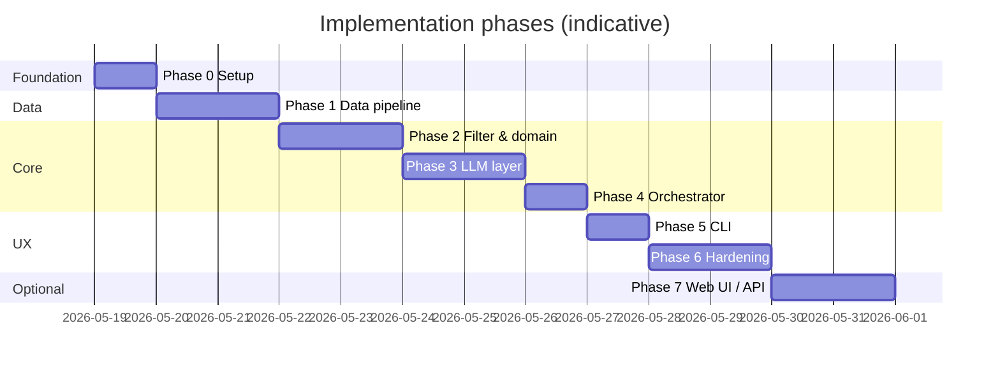
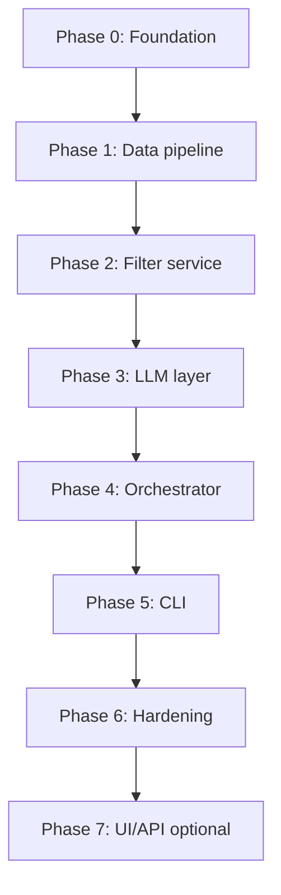

# Phase-Wise Implementation Plan

Implementation roadmap for the **AI-Powered Restaurant Recommendation System**, derived from [problemstatement.md](./problemstatement.md) and [architecture.md](./architecture.md).

**Delivery strategy:** Build bottom-up (data → domain → services → orchestrator → UI). Each phase ends with a runnable or testable increment. LLM integration starts only after deterministic filtering works.

---

## Overview



| Phase | Name | Primary outcome | Success criteria touched |
|-------|------|-----------------|--------------------------|
| 0 | Project foundation | Repo, config, tooling | — |
| 1 | Data pipeline | Cached dataset + repository | Dataset loads reliably |
| 2 | Filter & domain | Deterministic recommendations (no LLM) | Sensible candidate sets |
| 3 | LLM integration | Rank + explain with validation | Explanations, no hallucination |
| 4 | Orchestrator | End-to-end `recommend()` | Full workflow |
| 5 | CLI | User-facing demo | Display results |
| 6 | Hardening & tests | Production-ready prototype | All 5 success criteria |
| 7 | Optional UI/API | Streamlit or FastAPI | Better demo UX |

**Estimated total (Phases 0–6):** ~9–11 working days for one developer. Phase 7 is optional (+2 days).

---

## Phase 0: Project foundation

**Goal:** Establish repository structure, dependencies, and configuration so later phases plug in cleanly.

### Tasks

| # | Task | Output |
|---|------|--------|
| 0.1 | Create folder layout per [architecture.md §10](./architecture.md#10-proposed-repository-layout) | `src/`, `config/`, `data/`, `tests/`, `docs/` |
| 0.2 | Add `requirements.txt` (pandas, pyarrow, datasets, pydantic, pydantic-settings, typer, pytest, python-dotenv) | Pin major versions |
| 0.3 | Add `pyproject.toml` or `setup.cfg` so `restaurant_rec` is importable | `pip install -e .` works |
| 0.4 | Create `config/settings.yaml` and `config/budget_tiers.yaml` (placeholder ranges) | Config skeleton |
| 0.5 | Implement settings loader (`pydantic-settings`): YAML + env override | `Settings` class |
| 0.6 | Add `.env.example`, `.gitignore` (`data/*.parquet`, `.env`) | Secrets not committed |
| 0.7 | Add minimal `README.md`: Python version, install, env vars | Onboarding doc |
| 0.8 | Add `data/.gitkeep` | Cache directory exists |

### Deliverables

- Empty package `src/restaurant_rec/` with `__init__.py`
- `Settings` loads `HF_DATASET_ID`, `DATA_CACHE_PATH`, `MAX_CANDIDATES_FOR_LLM`, etc.
- `pytest` runs (zero tests OK)

### Exit criteria

- [ ] `pip install -r requirements.txt` succeeds
- [ ] `from restaurant_rec import ...` resolves
- [ ] `pytest` exits 0

### Dependencies

None.

---

## Phase 1: Data pipeline

**Goal:** Load the Hugging Face Zomato dataset, preprocess it, cache locally, and expose a queryable repository.

**Maps to:** Architecture §4.7 (Data pipeline), §6 (Domain model — `Restaurant`), problem statement §“Data ingestion”.

### Tasks

| # | Task | Output |
|---|------|--------|
| 1.1 | Implement `dataset_loader.py`: load `ManikaSaini/zomato-restaurant-recommendation` via `datasets` | Raw DataFrame |
| 1.2 | Inspect schema; document column mapping in code comments | Mapping dict |
| 1.3 | Implement `preprocessor.py`: drop/fix nulls, cast rating & cost types | Clean DataFrame |
| 1.4 | Normalize `city` / `location` and `cuisines` (lowercase, strip) | Consistent strings |
| 1.5 | Assign stable `restaurant_id` (e.g. `r_{index}` or hash of name+city) | Id column |
| 1.6 | Compute or load budget tier thresholds; write `config/budget_tiers.yaml` from data percentiles if needed | Tier config |
| 1.7 | Write cache to `data/restaurants.parquet` | Fast reload |
| 1.8 | Implement `restaurant_repository.py`: load from cache or trigger ingest | `get_all()`, `get_by_ids()` |
| 1.9 | Add script/CLI flag: `--refresh-data` to force re-download | Dev convenience |
| 1.10 | Log row count, cities, sample stats at startup | Observability |

### Deliverables

- `domain/models.py`: `Restaurant` dataclass / Pydantic model
- `infrastructure/dataset_loader.py`, `preprocessor.py`, `restaurant_repository.py`
- Cached `data/restaurants.parquet` (gitignored)

### Tests (Phase 1)

| Test | Assert |
|------|--------|
| `test_preprocessor_assigns_ids` | All rows have unique `restaurant_id` |
| `test_repository_loads_cache` | Row count > 0; required columns present |
| `test_no_null_ratings_after_clean` | Or explicitly dropped |

### Exit criteria

- [ ] First run downloads from Hugging Face and writes parquet
- [ ] Second run loads from cache in &lt; 2s
- [ ] Repository returns `Restaurant` objects with name, city, cuisines, rating, cost_for_two

### Dependencies

Phase 0.

---

## Phase 2: Domain preferences & filter service

**Goal:** Accept user preferences and return a deterministic, capped candidate list—**no LLM yet**. This validates the core data path and satisfies half the success criteria.

**Maps to:** Architecture §4.2 (Filter Service), §6.1 (`UserPreferences`), problem statement §“Integration layer” (filter portion).

### Tasks

| # | Task | Output |
|---|------|--------|
| 2.1 | Implement `domain/preferences.py`: `UserPreferences`, `Budget` enum, validation | Typed input |
| 2.2 | Implement `filter_service.py`: location filter (case-insensitive) | City match |
| 2.3 | Add cuisine filter (substring/token in cuisines field) | Cuisine match |
| 2.4 | Add `min_rating` filter | Rating threshold |
| 2.5 | Add budget filter using `budget_tiers.yaml` on `cost_for_two` | Tier match |
| 2.6 | Implement `cap_by_rating(candidates, N=15)`; secondary sort by votes if column exists | Top-N list |
| 2.7 | Return `NoMatchResult` type when filter yields zero rows + hint messages | Error path |
| 2.8 | Add temporary script: print top 10 filtered restaurants for a sample query | Manual verification |

### Deliverables

- `services/filter_service.py`
- `UserPreferences` with fields: location, budget, cuisine, min_rating, extras (extras unused until Phase 3)

### Tests (Phase 2)

| Test | Assert |
|------|--------|
| `test_filter_location` | Bangalore query excludes Delhi rows |
| `test_filter_budget_medium` | Costs within medium range only |
| `test_filter_min_rating` | All results `rating >= min_rating` |
| `test_cap_limits_count` | At most `MAX_CANDIDATES_FOR_LLM` |
| `test_no_match_empty` | Strict filters → empty list |

### Exit criteria

- [ ] Sample query: `Bangalore`, `medium`, `Italian`, `4.0` returns sensible candidates (manual check)
- [ ] Filters are pure functions / no side effects
- [ ] All unit tests pass

### Dependencies

Phase 1.

**Milestone:** *“Rating-only recommender”* — CLI can print top-N by rating from filters (optional quick demo before LLM).

---

## Phase 3: LLM integration layer

**Goal:** Rank and explain filtered candidates via LLM, with structured JSON output, parsing, and anti-hallucination validation.

**Maps to:** Architecture §4.3–4.6, §9 (LLM contract), problem statement §“Recommendation engine”.

### Tasks

| # | Task | Output |
|---|------|--------|
| 3.1 | Define `LLMClient` ABC in `infrastructure/llm/base.py` | Interface |
| 3.2 | Implement `groq_client.py` (primary); wire `GROQ_API_KEY` / `LLM_API_KEY`, model, temperature | Working API call |
| 3.3 | Stub `MockLLMClient` returning canned JSON for tests | Test double |
| 3.4 | Implement `prompt_builder.py`: system + user messages, candidate JSON with ids | Prompt templates |
| 3.5 | Encode constraints in system prompt: only list ids, JSON schema, reference extras | Hallucination guard |
| 3.6 | Implement `response_parser.py`: parse JSON; handle markdown code fences | `ParsedLLMResponse` |
| 3.7 | Implement `validator.py`: ids ⊆ candidates; merge facts from repository | `Recommendation` list |
| 3.8 | Strip invalid ids; single retry with stricter prompt on validation failure | Resilience |
| 3.9 | Fallback: if LLM fails twice, return top 3 by rating without explanations | Degraded mode |
| 3.10 | Log `llm_ms`, validation drop count | Observability |

### Deliverables

- `infrastructure/llm/base.py`, `groq_client.py`, `mock_client.py`
- `services/prompt_builder.py`, `response_parser.py`, `validator.py`
- `domain/models.py` extended: `Recommendation`, `RecommendationResult`

### Tests (Phase 3)

| Test | Assert |
|------|--------|
| `test_prompt_includes_all_candidate_ids` | Prompt contains each id |
| `test_parser_valid_json` | Parses sample response |
| `test_validator_rejects_unknown_id` | Foreign id dropped |
| `test_validator_uses_dataset_facts` | Name/rating/cost match row, not LLM text |
| `test_mock_llm_end_to_end` | Mock client → ≥1 valid `Recommendation` |

### Exit criteria

- [ ] Live LLM call returns JSON with ranks and explanations for a sample query
- [ ] No recommended `id` outside candidate set in automated tests
- [ ] Display fields sourced from dataset only

### Dependencies

Phase 2.

**Note:** Requires valid `GROQ_API_KEY` (or `LLM_API_KEY`). Use `MockLLMClient` in CI to avoid API costs.

---

## Phase 4: Recommendation orchestrator

**Goal:** Wire all services into a single application entry point: `recommend(preferences) → RecommendationResult`.

**Maps to:** Architecture §4.1, §7–8 (sequences), §13 (error handling).

### Tasks

| # | Task | Output |
|---|------|--------|
| 4.1 | Implement `application/orchestrator.py` with full pipeline from architecture | `recommend()` |
| 4.2 | Validate preferences at entry (missing location → error) | Early exit |
| 4.3 | Short-circuit on empty candidates → `NoMatchResult` (no LLM call) | Cost + safety |
| 4.4 | Attach metadata: `candidate_count`, `filter_ms`, `llm_ms` | Result metadata |
| 4.5 | Wire dependency injection: repository, filter, prompt, llm, parser, validator | Testable orchestrator |
| 4.6 | Factory/bootstrap in `main.py`: load settings, repo, clients at startup | App composition root |

### Deliverables

- `application/orchestrator.py`
- `RecommendationOrchestrator.recommend(user_preferences: UserPreferences) -> RecommendationResult | NoMatchResult`

### Tests (Phase 4)

| Test | Assert |
|------|--------|
| `test_orchestrator_no_match_skips_llm` | Mock LLM `call_count == 0` |
| `test_orchestrator_happy_path` | ≥3 recommendations with explanations |
| `test_orchestrator_invalid_prefs` | Raises or returns validation error |

### Exit criteria

- [ ] `recommend()` callable from Python REPL with real or mock LLM
- [ ] End-to-end latency logged; acceptable for demo (&lt; 5s typical with API)

### Dependencies

Phases 2–3.

---

## Phase 5: CLI presentation layer

**Goal:** Minimal user-facing interface to run queries and view formatted results.

**Maps to:** Architecture §3 (Presentation), problem statement §“Output display”, §“User input”.

### Tasks

| # | Task | Output |
|---|------|--------|
| 5.1 | Implement `presentation/cli.py` with Typer | CLI app |
| 5.2 | Flags: `--location`, `--budget`, `--cuisine`, `--min-rating`, `--extras` | All preference fields |
| 5.3 | Pretty-print: summary + ranked cards (rich or plain table) | Readable output |
| 5.4 | Handle `NoMatchResult` with suggestions (lower rating, change cuisine) | UX for empty |
| 5.5 | Entry point: `python -m restaurant_rec.main` | Runnable module |
| 5.6 | `--refresh-data` passthrough to loader | Data refresh |

### Example usage

```bash
python -m restaurant_rec.main \
  --location Bangalore \
  --budget medium \
  --cuisine Italian \
  --min-rating 4.0 \
  --extras "family-friendly, quick service"
```

### Deliverables

- `presentation/cli.py`, `main.py`

### Exit criteria

- [ ] Non-developer can run one command and see ≥3 recommendations with explanations
- [ ] Invalid input shows clear error message

### Dependencies

Phase 4.

---

## Phase 6: Hardening, testing & documentation

**Goal:** Meet all success criteria from the problem statement; stabilize for demo and handoff.

**Maps to:** Problem statement §“Success criteria”, architecture §13–15.

### Tasks

| # | Task | Output |
|---|------|--------|
| 6.1 | Complete unit test suite (filter, validator, parser) | ≥80% coverage on services |
| 6.2 | Integration test: HF load → cache → repository (mark `@slow`, skip in CI optional) | Pipeline test |
| 6.3 | E2E test: orchestrator + `MockLLMClient` | CI-safe E2E |
| 6.4 | Manual test matrix: 5 cities × 3 cuisines; spot-check names/ratings | Test log in docs |
| 6.5 | Implement all error paths from architecture §13 | Resilient app |
| 6.6 | Add structured logging (filter count, timings) | Debuggability |
| 6.7 | Update `README.md`: setup, API key, examples, troubleshooting | Complete docs |
| 6.8 | Check off success criteria in problem statement (or copy checklist here) | Traceability |

### Success criteria checklist

| Criterion | Verification |
|-----------|--------------|
| Dataset loads reliably | Integration test + CLI cold/warm start |
| ≥3 relevant suggestions | E2E + manual matrix |
| No fabricated venues | Validator unit tests + manual spot-check |
| Preference-aware explanations | Manual review of `--extras` queries |
| Reasonable demo latency | Log `duration_ms`; cap candidates at 15 |

### Exit criteria

- [ ] `pytest` passes (mock LLM; no network required in default CI)
- [ ] All five success criteria verified and documented
- [ ] README allows new developer to run demo in &lt; 15 minutes

### Dependencies

Phase 5.

**Milestone:** *MVP complete* — Phases 0–6 deliver the full problem statement scope.

---

## Phase 7 (optional): Web UI or REST API

**Goal:** Improve demo UX without changing core logic. Pick **one** path first.

**Maps to:** Architecture §12 (API), §16–17 (extensions), problem statement open questions.

### Option A: Streamlit UI (faster)

| # | Task |
|---|------|
| 7A.1 | `streamlit_app.py`: form for location, budget, cuisine, rating, extras |
| 7A.2 | Call `orchestrator.recommend()` on submit |
| 7A.3 | Display cards: name, cuisine, rating, cost, explanation |
| 7A.4 | Sidebar: dataset stats, refresh data button |

### Option B: FastAPI (API-first)

| # | Task |
|---|------|
| 7B.1 | `POST /api/v1/recommendations` → orchestrator |
| 7B.2 | `GET /api/v1/health`, `GET /api/v1/meta/locations` |
| 7B.3 | Pydantic request/response models aligned with architecture §12 |
| 7B.4 | OpenAPI docs at `/docs` |

### Exit criteria (either option)

- [ ] Same `recommend()` logic as CLI; no duplicated business rules
- [ ] Demo runnable without terminal flags

### Dependencies

Phase 6.

---

## Phase 8 (future): Extensions (out of v1 scope)

Track for later; not required for MVP.

| Item | Prerequisite | Notes |
|------|--------------|-------|
| OpenAI / Anthropic / Ollama adapters | Phase 3+ | Implement `LLMClient` |
| Per-city budget tiers | Phase 1 | Extend `budget_tiers.yaml` |
| Feedback loop | Phase 7B | New endpoint + prompt context |
| Embeddings pre-filter | Phase 2 | Optional semantic stage |
| Multi-language explanations | Phase 3 | Prompt locale or post-translate |
| Docker deployment | Phase 6 | Bake cache or init container |

---

## Cross-phase dependency graph



---

## Component build order (reference)

Build modules in this order to minimize blocked work:

1. `config` / `Settings`
2. `domain/models.py`, `domain/preferences.py`
3. `infrastructure/dataset_loader.py` → `preprocessor.py` → `restaurant_repository.py`
4. `services/filter_service.py`
5. `infrastructure/llm/base.py` → `groq_client.py`
6. `services/prompt_builder.py` → `response_parser.py` → `validator.py`
7. `application/orchestrator.py`
8. `presentation/cli.py` → `main.py`
9. `tests/*`
10. (Optional) `presentation/streamlit_app.py` or FastAPI app

---

## Risk register

| Risk | Impact | Mitigation | Phase |
|------|--------|------------|-------|
| HF dataset schema differs from docs | Broken mapping | Inspect columns in 1.2; adapt mapper | 1 |
| API key missing / quota exceeded | No LLM results | Mock client for dev; rating fallback | 3, 6 |
| LLM returns invalid JSON | Empty UI | Parser retry + fallback | 3 |
| LLM hallucinates restaurants | Wrong recommendations | Id validator; facts from repo | 3 |
| Too few candidates after filter | Poor demo | Relax defaults; document sample queries | 2, 6 |
| Slow cold start (HF download) | Bad first impression | Document cache; ship sample parquet optional | 1 |

---

## Suggested demo queries (manual QA)

Use after Phase 5 to validate end-to-end:

| Location | Budget | Cuisine | Min rating | Extras |
|----------|--------|---------|------------|--------|
| Bangalore | medium | Italian | 4.0 | family-friendly |
| Delhi | low | Chinese | 3.5 | quick service |
| Mumbai | high | North Indian | 4.5 | — |
| Hyderabad | medium | Biryani | 4.0 | — |

---

## Document map

| Document | Role |
|----------|------|
| [problemstatement.md](./problemstatement.md) | What & why; success criteria |
| [architecture.md](./architecture.md) | How; components & contracts |
| **implementation-plan.md** (this file) | When & in what order |
| [edgecase.md](./edgecase.md) | Edge cases & expected behavior |
| [phases/](./phases/) | Per-phase evaluation criteria (`phase-N-eval.md`) |

---

## Quick start for implementers

1. Complete **Phase 0** in one session.
2. **Phase 1** is blocking—do not skip; verify parquet cache.
3. **Phase 2** before any LLM work—prove filters with print/debug script.
4. Use **MockLLMClient** through Phase 4–6 for fast iteration.
5. Add real LLM in Phase 3 only when filters look correct.
6. Treat **Phase 6** as required, not optional—it's where success criteria are proven.
7. Add **Phase 7** only if CLI demo is insufficient for your audience.
